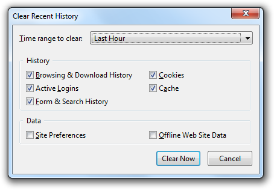

Today I learned super useful shortcut in Firefox to quickly access Clear Recent
History menu.

Press `CTRL-SHIFT-DELETE` and you should see following menu:

For me, this shortcut is really useful to quickly clean up stale redirects or
cache when developing Nginx Ingress.
